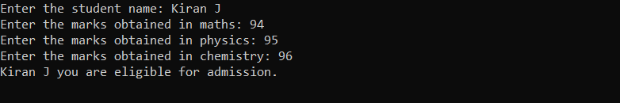
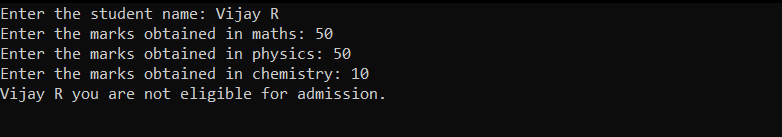

# Eligibility-for-Admission

## Aim:
To write C# program to find the eligibility for admission to an engineering course

## Algorithnm:
### STEP 1: 
Declare variables for maths, physics, chemistry, and totalMarks.

### STEP 2:
Use the Console.ReadLine() to get the inputs from the user.

### STEP 3: 
Calculate totalMarks as per the elegibility is mentioned.

### STEP 4: 
Check whether the student is eligible for admission using if else condition wth the given eligibility criteria.

### STEP 5: 
Use the Console.WriteLine() to display the eligibility status of the student.  

## Program:
Name: Kiran J

Ref no: 212221240022
~~~python
using System;
class EligibilityforAdmission
{
    static void Main(string[] args)
    {
        int maths, physics, chemistry, totalMarks1 ,totalMarks2;
        string name;
        Console.Write("Enter the student name: ");
        name = Console.ReadLine();

        Console.Write("Enter the marks obtained in maths: ");
        maths = Convert.ToInt32(Console.ReadLine());

        Console.Write("Enter the marks obtained in physics: ");
        physics = Convert.ToInt32(Console.ReadLine());

        Console.Write("Enter the marks obtained in chemistry: ");
        chemistry = Convert.ToInt32(Console.ReadLine());

        totalMarks1 = maths + physics + chemistry;
        totalMarks2 = maths + physics;
        if (maths >= 65 && physics >= 55 && chemistry >= 50 && totalMarks1 >= 180 || totalMarks2 >= 140)
        {
            Console.WriteLine(name+" you are eligible for admission.");
        }
        else
        {
            Console.WriteLine(name+" you are not eligible for admission.");
        }
        Console.ReadLine();
    }
}
~~~

## Output:

## Result:
Thus, C# program to find the eligibility for admission to an engineering course has been executed successfully.
